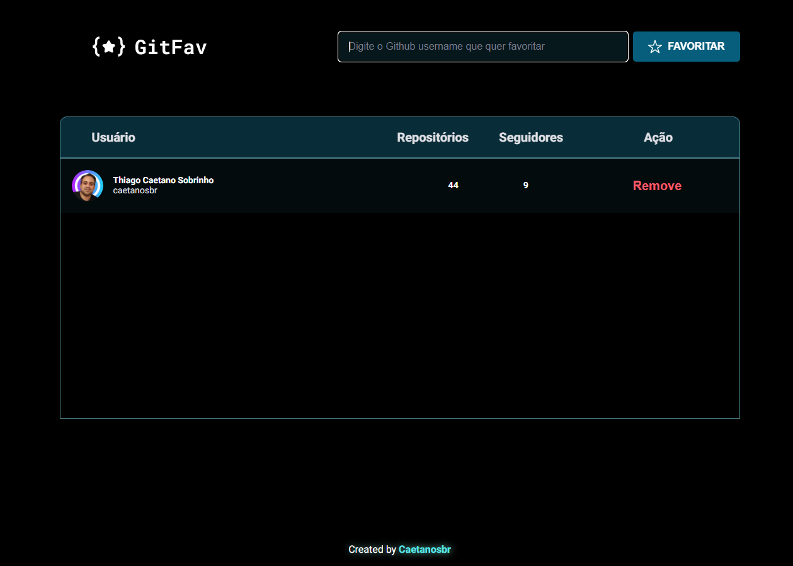

<h1 align="center"> GitFav </h1>

  <a href="#-tecnologias">Tecnologias</a>&nbsp;&nbsp;&nbsp;|&nbsp;&nbsp;&nbsp;
  <a href="#-projeto">Projeto</a>&nbsp;&nbsp;&nbsp;&nbsp;&nbsp;&nbsp;</a>

 

  

## 🚀 Tecnologias

- Consumindo API do Github
- Aprendendo a criar uma classe Screen reader only
- Programação orientada a objetos (POO)
- Classes e heranças
- Criando HTML pelo JavaScript
- A importancia da imutabilidade
- Conhecendo o localStorage
- Métodos estáticos e promises
- Async Await promises
- Fluxo da aplicação com Try, Catch e Throw
- Criação de tabelas no HTML

## 💻 Projeto

GivFav busca usuários do GitHub por API e mostra no seu favoritos. Projeto desenvolvido por mim para o desafio 06 do Rocketseat do Explorer. Treino do conceito SPA + API, JavaScript Puro, Async, Promise, Extends etc..

---

 By Thiago Caetano :wave: [LinkedIn]() e [GitHub](https://github.com/caetanosbr)

 Deploy: [Projeto Pronto](https://caetanosbr.github.io/GitFav/)
